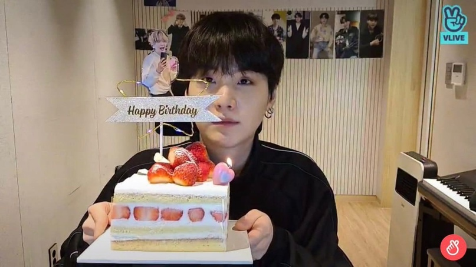

## Working week

This week was memorable and special! March 8 is International Women's Day, so Friday was a day off. In general, the week passed quickly and unnoticed. I attended the university as usual and went to dance practice on Wednesday evening. On Thursday, I returned home to my hometown of Nizhny Novgorod by train, as there is a long weekend ahead.

emoji: 🌸🚂💃

## Weekend

We went go-karting on weekends (3 times already in my life). I have almost overtaken everyone and finally arrived the 3rd, not the last! Then we went to the shooting range. We fired a pistol and a submachine gun. I really liked it, and my mom was surprised why I shoot so well. And on Sunday, the whole family went bowling. We had a great time, played bowling and ate pizza.

emoji: 🏎️🔫🎳🍕

## Plans for next week

I already returned to Moscow on Tuesday. And I have a lot to do!!!
- 5th and 6th laboratory work on computer architecture
- the second stage of an individual computer architecture project
- laboratory work and computer workshop report

I hope I'll make it in time)

emoji: 🌆📚✨

## P.S.

And on March 9th, my bios Min Yoongi's birthday (he turned 31 this year). Traditionally, I bought a small piece of cake and blew out the candles.

