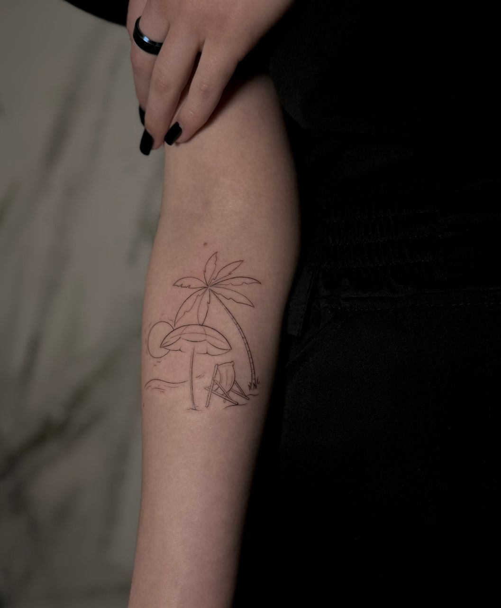

## Work week

This week has been more or less easy. On Monday, I missed a remote couple in discrete mathematics, as I was on my way to beat a tattoo. This is my very first tattoo and I am very happy. It depicts a palm tree, a beach umbrella, a chaise longue, a wave and the sun. And the meaning of this tattoo is like this: I always wanted to live by the sea or ocean, lie on the beach, so that there was a palm tree on my right and a beach umbrella on my left and it was +40 degrees. 

On Thursday, I wrote a test paper on mathematical analysis. I have solved all the tasks and I really hope that everything is right for me!

emoji: 🏖️🌊☀️

## Weekend

I had a rest all day on Saturday! And on Sunday, I went to the grocery store to buy food, because I only had a pack of ketchup and a pack of eggs in the refrigerator. When I returned home, I cooked shrimp in cream sauce for the first time and realized that I finally learned how to cook!)

In the evening, I met with a friend and we were preparing for a CD in discrete mathematics.

emoji: 🍤🛒

## Plans for next week

- Repeat the choreography of the dance "LALALALA" - Stray kids by Wednesday
- Prepare for the CD in discrete mathematics

I hope I'll make it in time)

emoji: 🕺📚⏰

## P.S.

It was +17 degrees in Moscow at the weekend!!! I really like warm weather.
