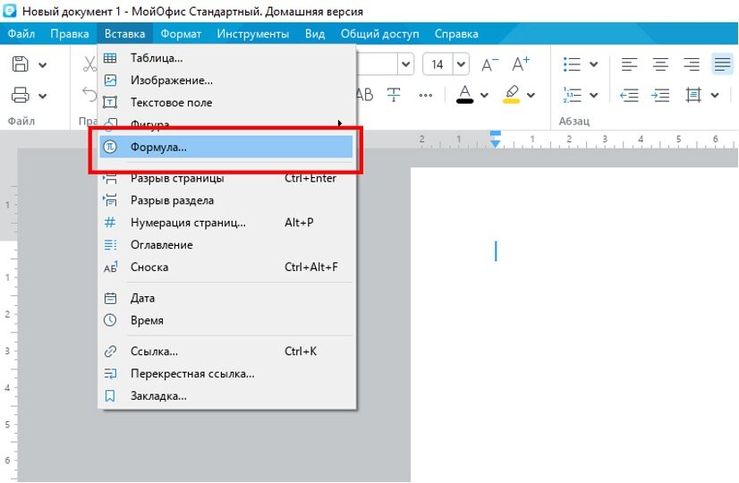
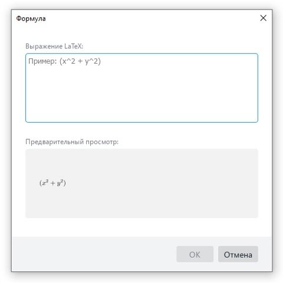
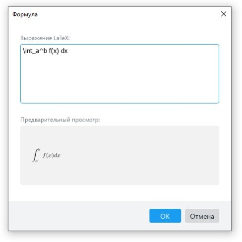
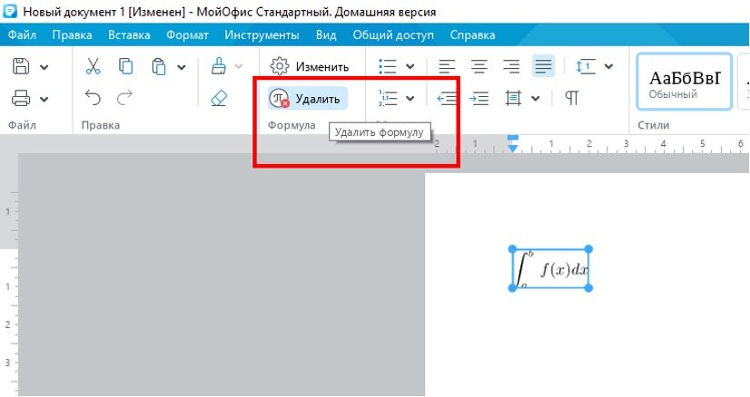
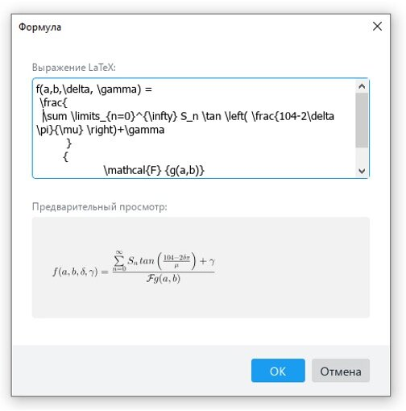

## What is LaTeX?

LaTEX (pronounced "latech" or "latech") is a tool for creating professional documents. It is based on the WYSIWYM editing paradigm (what I see is what I mean), that is, the user is required to focus only on the contents of the document, leaving its formatting to the program. Instead of manually distributing the text on the page, as is done in Microsoft Word or LibreOffice Writer, you can simply type it, allowing LaTeX to do the rest.

## Why do I need LaTeX?

This tool is used everywhere to create scientific documents, write books, as well as many other forms of publications. It not only allows you to create beautifully designed documents, but also gives users the opportunity to quickly implement such complex elements of a printed set as mathematical expressions, tables, links and bibliographies, obtaining consistent markup across all sections.

Due to the availability of a large number of open libraries (more on this later), the possibilities of LaTEX become almost limitless. These libraries empower users even more by allowing you to add footnotes, draw diagrams, etc.

One of the most compelling reasons why many people use LaTeX is to separate the content of a document from its style. This means that after writing the content, you can easily change its appearance. Similarly, you can create one document style and use it to standardize the appearance of others.

This allows scientific journals to create templates for the materials offered for consideration. Such templates have a set markup, as a result of which only the content remains to be added. In fact, there are hundreds of similar templates, ranging from various summaries to slide presentations.

## Highlights of the work

Working with LaTeX boils down to writing code that has several basic components and fragments. At the same time, you need to know a few nuances:

- In-text formulas are surrounded on both sides by $ signs.

- Off formulas (placed in a separate line) are surrounded by $ signs or a pair of commands \[ and \]. Formulas enclosed in $ are always centered horizontally.

- In-text formulas, except for the shortest ones, are typed in a separate line.

- The following tags are used to align the document: \flushleft — on the left edge, \flushrigth — on the right edge, \center — in the center.

- Verbatim's default environment helps to correctly display even complex program code.

- Most mathematical functions and symbols, as well as brackets, matrices and systems of equations in LaTeX syntax are indicated by tags starting with the \ symbol.

- To work with expressions that take up more than one line (that is, for careful text wrapping or calculations), you can use the \\ separator.

- The letters of the Greek language and lemniscate, the infinity symbol and others are entered as tags. stored in one place, you risk losing everything.

## How to use LaTeX in the editor "MyOffice Text"

In MyOffice, LaTeX is used to enter formulas and mathematical expressions.

To insert a formula, go to the "Insert" menu on the toolbar, select the "Formula" item.

After confirmation, a pop-up window will appear with the "LaTeX Expression" and "Preview" fields.

For example, we introduce a simple formula for a certain integral of the function f(x) on the interval [a, b]. It will look like this.

\int_a^b f(x) dx

In the Preview field, you can immediately see what the final formula will look like. This is convenient — if necessary, you can make edits immediately on the spot, and not after inserting the formula into the document.

After inserting the formula, it, like any other object in the MyOffice Text editor, can be moved, aligned, and even resized.

If you need to edit the formula, just double—click on it with the left mouse button - a pop-up window with edit and preview fields will open.

You can delete a formula using the [Backspace], [Del] keys or a special button on the toolbar.

You can work with more complex formulas in a similar way. For example, consider a conditional function with four variables. For the convenience of reading the formula, we will immediately divide it into lines.

f(a,b,\delta, \gamma) =

\frac{

\sum \limits_{n=0}^{\infty} S_n \tan \left( \frac{104-2\delta \pi}{\mu} \right)+\gamma

}

{

\mathcal{F} {g(a,b)}

}

Immediately in the preview field we can see that the formula is displayed correctly.

Formatting is preserved when pasted into a document.

It is noteworthy that the formula editor helps to find errors. For example, if we put an extra space in the \gamma operator in the specified formula, when inserting the editor "MyOffice Text" will show an error — it will highlight the place in red.

This is convenient and protects against accidental errors.

With LaTex, you can write not only formulas, but also edit texts.
