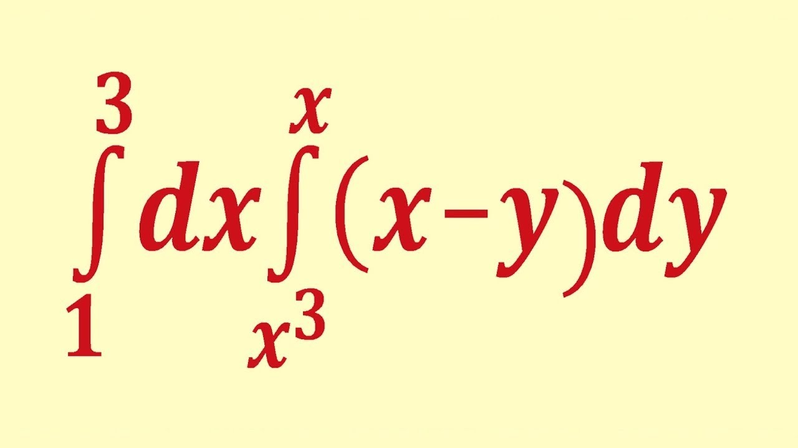

## Рабочая неделя

## Work week

This week has been boring!!! Nothing interesting happened:( 

I went dancing on Wednesday. We danced "deja vu" - txt. At first I didn't really like this choreography, but then I really liked it!

On Thursday, at the matanalysis, we started going through double integrals and I was very happy, because of all mathematics, I love integrals! I can't even find the words how much I love integrals!!!

emoji: 🥱💃∫

## Weekend

It's Saturday and I'm doing stage 4 of an individual project.
On Sunday it's my turn to clean, so tomorrow I will clean the hut(((

emoji:  💻🧹

## Plans for next week

- Take an Arduino kit and do a computer workshop lab
- Have more rest :)

emoji: 🤖💻😴

## P.S.

There was a very strong wind and rain on Friday. I don't like this weather(
The sun would be better!
