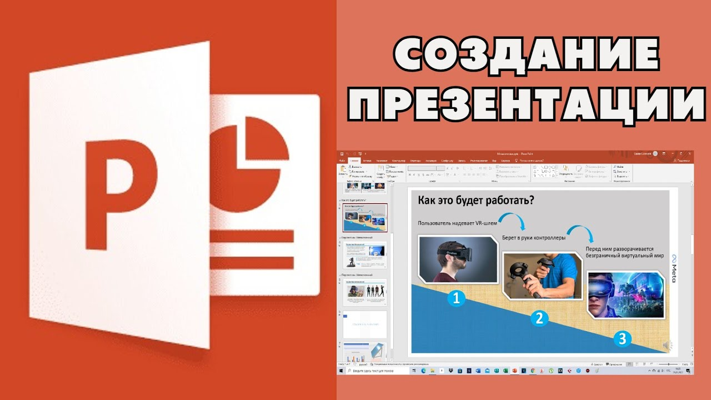

## Introduction

A high-quality presentation can create the most favorable impressions about you and become your assistant during the performance. At the same time, hastily prepared slides with many errors in design and content will demonstrate your negligence and become a reason for numerous quibbles. Do not rush to make slides right away, but rather start working with careful preparation.

## Preparatory work

First of all, make a detailed presentation plan. In the plan, describe the structure of the report, and in front of each element of this structure, specify the approximate number of slides based on their total number. If the optimal number of slides was not announced to you at the upcoming event, then use common sense: 20-30 slides is too much for a small report, 3-5 slides are too few. Keep in mind that the slides should reflect really meaningful information, and not contain separate pieces of text that will sound in your report without it. First of all, it should be statistical information, various graphs, diagrams, drawings — everything that will make your report more visual.

## AN APPROXIMATE PLAN MAY BE AS FOLLOWS:

Presentation of the report

- Slide No. 1. Information about the work, the author…

Introduction

- Slide No. 2. Definition of relevance and problems. Table about…
- Slide No. 3. Definition of other elements of the introduction.

The main part

- Slide No.4. Theoretical provisions…
- Slide No. 5. Diagram about…
- Slide No. 6. Drawing…

…

Conclusion

- Slide No. 9. Conclusions.
- Slide No. 10. Contact details.

Before creating a presentation, carefully study the requirements for this type of work (see below). If specific requirements have been announced at the event for which the presentation is being prepared, do not ignore them. Ask for sample presentations. If you are preparing a presentation for graduation, be sure to discuss the presentation plan with your supervisor.

## Presentation Requirements

1. The presentation should reflect the content of the report and not have elements that the speaker does not plan to comment on.
2. Each slide should be clear and understandable to the audience for which the report is intended.
3. Slides should not be overloaded with information, as well as be meaningless. It is advisable to use short sentences and, if possible, exclude words that complicate reading or do not carry a load (introductory words, complex terms, long speech phrases, etc.).
4. The colors of individual elements of the slide and all slides as a whole should be combined with each other. If necessary, use the color matching tables. Contrasting tones should be used for the background and text, but the background should not be too bright so as not to tire the audience.
5. Slide design and auxiliary information such as control buttons should not distract viewers from the content of the presentation. The same goes for animation effects.

## Mistakes when creating a presentation and speaking

1. There are too many slides. With this approach, the audience gets tired of listening to the report and realizes that you have not worked with highlighting the main thing. If you have presented less than a dozen slides, you can also create a negative impression of your hard work and serious attitude.
2. The slides are easy to read on the monitor, but not visible in a large audience.
3. The slides are too mismatched: the text is located at different levels in different slides, decorated with different fonts, the elements are arranged randomly, etc.
4. The presentation causes a negative reaction from a grin to outrage due to overloaded animation effects or too flashy design.
5. There are violations in the content component: the presentation poorly reveals the material of the report, the conclusions are not confirmed by reliable sources, spelling and other errors are present, etc.
6. The slide show does not coincide with the speaker's speech.
7. The speaker failed to interest the audience either with the report or with the slides presented.
8. The speaker gets confused in his own presentation, flipping through the slides in different directions, or violates the logic of the narrative.

## Creating a presentation and refining it

The most suitable program for creating a presentation with rich functionality is Microsoft PowerPoint. You can easily present tables, graphs, photos or video clips in it.

On the surface, working with it seems simple, since creating slides or inserting text, drawings and other elements into them is not particularly difficult. However, the process becomes much more complicated when it comes to correcting an element. Here it turns out that it is not so easy to change the theme of a separate slide, bring all the elements to a single style or adjust the effects as needed.

If you want to make a high-quality presentation, and not work at the "blunder" level, start creating it long before the event or use outside help.

When the presentation is completed, be sure to test it several times in different conditions. The first test is a demonstration on your own computer. Make sure that you have not made the above mistakes, and also evaluate your work as a whole. A properly designed presentation should evoke a sense of harmony, style and the feeling that its author has taste. After that, show the presentation to the teacher if you are preparing to defend your graduation thesis. If you speak at a conference or other event on your own initiative, consult with experienced teachers to make your presentation more effective.

The second check is carried out directly in the auditorium where the planned event will take place. Students often get lost just because they don't know how to flip through slides using the remote control. Don't worry, it's no more difficult than switching channels on the TV remote. Preparations for a major event usually begin a few hours before it starts, so you will have time to learn how to use the appropriate equipment or correct unsuccessful slides.
