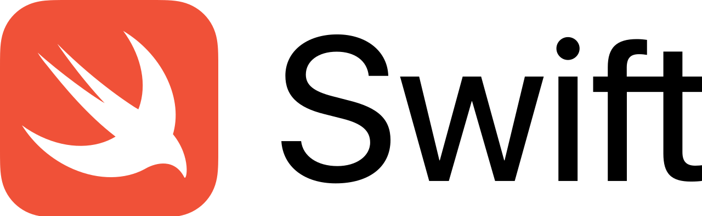
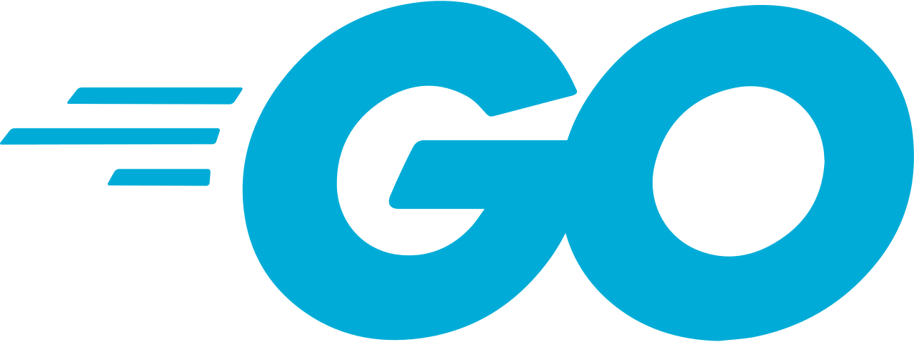

## Introduction

Programming is constantly evolving, and with it the programming languages that developers use. To be successful in the IT world, it is important to choose an up-to-date and in-demand programming language to study.

## Programming languages

### Python

Python is a general purpose programming language with a simple syntax, which makes it ideal for beginners. It is in demand in the development of web applications, scientific research, machine learning and artificial intelligence. Thanks to the rich ecosystem of libraries and tools, Python continues to hold its position as a leader.

### JavaScript

JavaScript remains the main language for web development, responsible for the interactivity and dynamism of websites. With the development of frameworks and libraries such as React, Angular and Vue.js, JavaScript has become an integral part of modern web development.

### Java

Java holds a special place among programming languages due to its platform independence and scalability. It is widely used for the development of Android applications and enterprise systems. Learning Java opens up access to a wide range of opportunities in different industries.

### C#

C# was developed by Microsoft as part of the platform.NET is considered one of the most versatile programming languages. It is used to create desktop, web and mobile applications, as well as games on the Unity platform.

### Kotlin

Kotlin is a modern programming language developed by JetBrains, which is rapidly gaining popularity due to its compatibility with Java and ease of use. Google officially supports Kotlin for Android app development, which makes it a sought‑after language among mobile developers.

### Swift

Swift is a programming language developed by Apple for creating native applications on iOS, macOS, watchOS and tvOS platforms. Fast and secure, Swift has become a key tool for Apple developers and an excellent choice for those who want to develop mobile applications.

### Go

Go, or Golang, is a programming language created at Google to address scalability and efficiency issues. It is easy to learn, fast and reliable, which makes it popular for building high-performance systems such as cloud services and network applications.

### Rust

Rust is a programming language developed by Mozilla with a focus on security and performance. Due to its unique memory management mechanisms and parallelism approach, Rust attracts the attention of developers and becomes an attractive language to learn.

### TypeScript

TypeScript is an add—on to JavaScript developed by Microsoft to improve static typing and code scalability. TypeScript allows you to detect errors at the stage of writing code, which improves the quality and reliability of applications being developed. Integration with popular frameworks makes TypeScript a sought‑after language among web developers.

### Ruby

Ruby is another general–purpose programming language known for its expressive and readable syntax. The main advantage of Ruby is the Ruby on Rails framework, which greatly simplifies the development of web applications and makes Ruby relevant for web developers.
