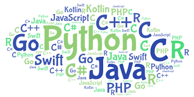
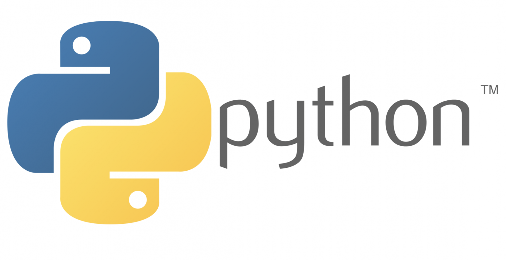
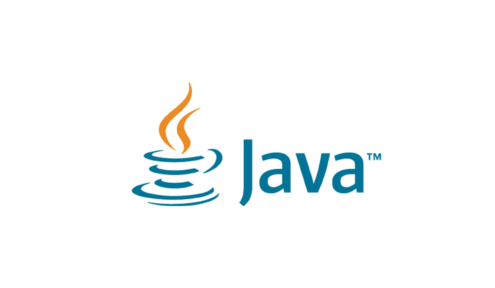
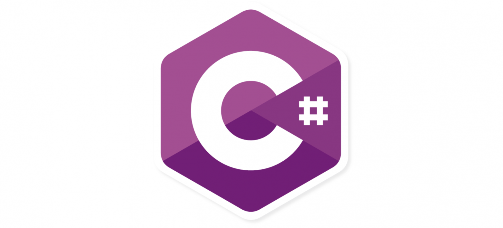

## Введение

Программирование постоянно развивается, а с ним и языки программирования, которые используются разработчиками. Чтобы быть успешным в мире IT, важно выбрать актуальный и востребованный язык программирования для изучения.

## Языки программирования

### Python

Python — язык программирования общего назначения с простым синтаксисом, что делает его идеальным для начинающих. Востребован в разработке веб‑приложений, научных исследований, машинного обучения и искусственного интеллекта. Благодаря богатой экосистеме библиотек и инструментов, Python продолжает удерживать позиции лидера.

### JavaScript

JavaScript остается основным языком для веб‑разработки, отвечая за интерактивность и динамичность сайтов. С развитием фреймворков и библиотек, таких как React, Angular и Vue.js, JavaScript стал неотъемлемой частью современной веб‑разработки.

### Java

Java занимает особое место среди языков программирования благодаря своей платформенной независимости и масштабируемости. Широко используется для разработки Android‑приложений и корпоративных систем. Обучение Java открывает доступ к широкому спектру возможностей в разных отраслях.

### C#

C# разрабатывался Microsoft как часть платформы .NET и считается одним из самых универсальных языков программирования. Применяется для создания десктопных, веб‑ и мобильных приложений, а также игр на платформе Unity.

### Kotlin

Kotlin — современный язык программирования, разработанный JetBrains, который быстро набирает популярность благодаря своей совместимости с Java и удобству использования. Google официально поддерживает Kotlin для разработки Android‑приложений, что делает его востребованным языком среди мобильных разработчиков.

### Swift

Swift — язык программирования, разработанный Apple для создания нативных приложений на платформах iOS, macOS, watchOS и tvOS. Быстрый и безопасный, Swift стал ключевым инструментом для разработчиков Apple и отличным выбором для тех, кто хочет заниматься разработкой мобильных приложений.

### Go

Go, или Golang, — это язык программирования, созданный в Google для решения проблем масштабируемости и эффективности. Он легок в изучении, быстр и надежен, что делает его популярным для создания высокопроизводительных систем, таких как облачные сервисы и сетевые приложения.

### Rust

Rust — язык программирования, разработанный Mozilla с акцентом на безопасность и производительность. Благодаря своим уникальным механизмам управления памятью и подходу к параллелизму, Rust привлекает внимание разработчиков и становится привлекательным языком для изучения.

### TypeScript

TypeScript — это надстройка над JavaScript, разработанная Microsoft для улучшения статической типизации и масштабируемости кода. TypeScript позволяет обнаружить ошибки на этапе написания кода, что повышает качество и надежность разрабатываемых приложений. Интеграция с популярными фреймворками делает TypeScript востребованным языком среди веб‑разработчиков.

### Ruby

Ruby – еще один язык программирования общего назначения, известный своим выразительным и читаемым синтаксисом. Основным преимуществом Ruby является фреймворк Ruby on Rails, который значительно упрощает разработку веб-приложений и делает Ruby актуальным для веб-разработчиков.

