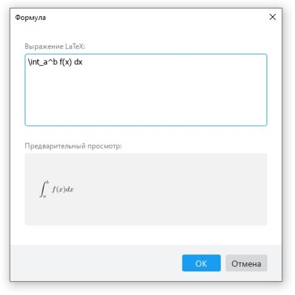
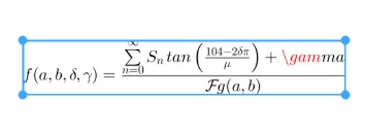

## Что такое LaTeX?

LaTEX (произносится как «лэйтех» или «латех») представляет собой инструмент для создания профессиональных документов. В его основе лежит парадигма редактирования WYSIWYM (что вижу, то и подразумеваю), то есть от пользователя требуется сосредоточиться только на содержимом документа, оставив его форматирование программе. Вместо ручного распределения текста по странице, как это делается в Microsoft Word или LibreOffice Writer, можно просто его вводить, позволив LaTeX заняться остальным.

## Зачем нужен LaTeX?

Этот инструмент используется повсеместно для создания научных документов, написания книг, а также многих других форм публикаций. Он позволяет не только создавать красиво оформленные документы, но также дает пользователям возможность очень быстро реализовывать такие сложные элементы печатного набора, как математические выражения, таблицы, ссылки и библиографии, получая согласованную разметку по всем разделам.

Благодаря доступности большого числа открытых библиотек (об этом чуть позже) возможности LaTEX становятся практически безграничны. Эти библиотеки расширяют возможности пользователей еще больше, позволяя добавлять сноски, рисовать схемы и пр.

Одна из наиболее веских причин, по которой многие используют LaTeX, заключается в отделении содержания документа от его стиля. Это означает, что после написания содержимого, можно с легкостью изменять его внешний вид. Аналогичным образом, можно создать один стиль документа и использовать его для стандартизации внешнего вида других.

Это позволяет научным журналам создавать шаблоны для предлагаемых на рассмотрение материалов. Такие шаблоны имеют заданную разметку, в результате чего добавить остается лишь содержание. На деле существуют сотни подобных шаблонов, начиная с различных резюме и заканчивая презентациями слайдов.

## Основные моменты работы

Работа с LaTeX сводится к написанию кода, в котором есть несколько базовых компонентов и фрагментов. При этом, надо знать несколько нюансов:

- Внутритекстовые формулы окружаются с обеих сторон знаками $.

- Выключнные формулы (вынесенные в отдельную строку) окружаются знаками $ или парой команд \[ и \]. Формулы, заключенные в $ всегда центрируются по горизонтали.

- Внутритекстовые формулы, за исключением самых коротких, набираются отдельной строкой.

- Для выравнивания документа служат теги: \flushleft — по левому краю, \flushrigth — по правому краю, \center — по центру.

- Окружение verbatim по умолчанию помогает корректно отображать даже сложный программный код.

- Большинство математических функций и символов, а также скобки, матрицы и системы уравнений в синтаксисе LaTeX обозначаются тегами, начинающимися с символа \.

- Для работы с выражениями, которые занимают больше одной строки (то есть для аккуратного переноса текста или вычислений), можно использовать разделитель \\.

- Буквы греческого языка и лемниската, символ бесконечности и другие вводятся в виде тегов. хранится в одном месте, вы рискуете потерять всё.

## Как пользоваться LaTeX в редакторе «МойОфис Текст»

В МойОфис LaTeX используется для ввода формул и математических выражений.

Чтобы вставить формулу заходим в меню «Вставка» на панели инструментов, выбираем пункт «Формула».

После подтверждения появится всплывающее окно с полями «Выражение LaTeX» и «Предварительный просмотр».

Для примера введем простую формулу определенного интеграла функции f(x) на интервале [a, b]. Она будет иметь следующий вид.

\int_a^b f(x) dx

В поле «Предварительный просмотр» можно сразу увидеть, как будет выглядеть итоговая формула. Это удобно — при необходимости вносить правки можно сразу по месту, а не после вставки формулы в документ.

После вставки формулы ее, как и любой другой объект в редакторе «МойОфис Текст» можно перемещать, выравнивать и даже изменять размеры.

Если формулу нужно отредактировать, достаточно дважды кликнуть по ней левой кнопкой мыши — откроется всплывающее окно с полями правок и предварительного просмотра.

Удалить формулу можно клавишами [Backspace], [Del] или специальной кнопкой на панели инструментов.

Аналогичным образом можно работать и с более сложными формулами. Например, рассмотрим условную функцию с четырьмя переменными. Для удобства чтения формулы сразу разделим ее на строки.

f(a,b,\delta, \gamma) =

\frac{

\sum \limits_{n=0}^{\infty} S_n \tan \left( \frac{104-2\delta \pi}{\mu} \right)+\gamma

}

{

\mathcal{F} {g(a,b)}

}

Сразу в поле предварительного просмотра можем увидеть, что формула отображается правильно.

При вставке в документ форматирование сохраняется.

Примечательно, что редактор формул помогает найти ошибки. Например, если в указанной формуле мы поставим лишний пробел в операторе \gamma, при вставке редактор «МойОфис Текст» покажет ошибку — выделит место красным.

Это удобно и защищает от случайных ошибок.

С помощью LaTex, можно писать не только формулы, но и ещё редактировать тексты.

